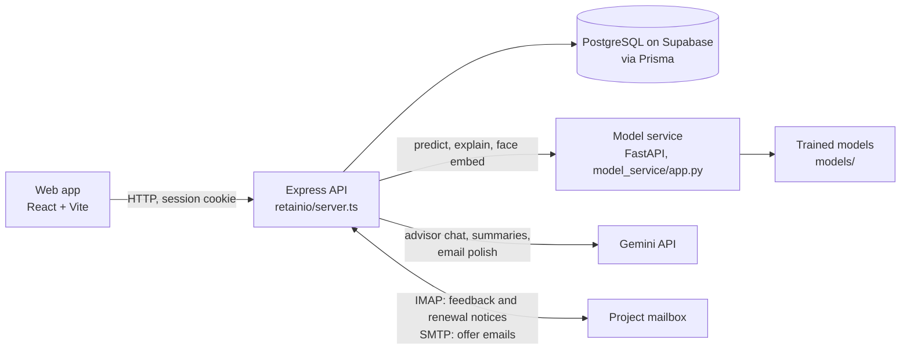

# RetainIO

**AI-powered customer churn prediction and retention platform for B2B SaaS.**
Year 3 Major Project (CMP3101), Diploma in Applied Artificial Intelligence, Temasek Polytechnic,
by Paramanandam Barath.

RetainIO helps Account Managers see which customer accounts are likely to leave, why, and whether
a discount would actually change the outcome. They can then make an offer within the company's
approval rules. Every action is recorded, and what happens at each renewal is kept so the models
can be retrained on real outcomes.

## What it does

- **Risk scoring.** A churn model reads each account's usage, and a sentiment model reads the
  customer's latest review or email. A stacking model combines the two into one risk score.
  Every active account is re-scored daily, and an Account Manager can re-score one on demand.
- **Why This Score.** The factors behind each churn prediction (SHAP), written as plain sentences,
  plus an AI-written summary of the account (Gemini).
- **Discount Uplift Advisor.** A causal uplift model estimates how much each of 21 offers
  (5, 10, 15, 20 or 25% for 3, 6, 9 or 12 months, or no discount) would change the chance that
  this customer renews. It answers "would a discount help here?", not just "is this account at risk?".
- **Retention offers with approval rules.**
  - Offers open in the final 180 days before a renewal, or earlier if the customer says they are leaving.
  - An Account Manager can approve an offer worth up to 10% of the account's annual contract value.
    Anything bigger goes to an Account Director, who must pass a live face check (FaceNet embeddings).
  - Offers cannot stack, and one that has not started yet can be withdrawn.
  - The offer email is sent to the customer from the platform.
- **Renewals.** Customers' notices that they will leave, upgrade or downgrade are recorded by hand or
  read automatically from emails. What actually happened is captured at the end of each term.
  An account that churns leaves the working lists and counts, keeps its final score, and is listed
  in a separate "Churned accounts" section; correcting the outcome brings it back.
- **Learning from outcomes.** Each account is measured before any offer reaches it. Renewal outcomes,
  and managers' corrections to the sentiment model, are exported in the training format for retraining.
- **AI advisor chat.** A Gemini agent that can look up an account's scores and search the retention
  policy, playbooks and past cases.
- **Audit Log.** Every approval, rejection, withdrawal, renewal and offer email, with a PDF export.
- **Roles.** Account Manager, Account Director and Admin, each seeing only what they should.

## How the parts fit together



- The browser never computes a score. It calls the Express API, which calls the model service for
  every prediction and stores the results in PostgreSQL.
- The API enforces every rule (approval limits, the offer window, no stacking), so nothing depends on
  the browser behaving.
- Background jobs run inside the server:
  - the daily update at 00:15 UTC (08:15 in Singapore), also run on start-up with a six-hourly
    safety net. It fills in simulated usage when that is switched on (see
    [Simulated usage](#simulated-usage)), re-scores every active account, measures accounts entering
    the offer window and resolves renewals that have come due;
  - an inbox check every two minutes, when a mailbox is configured.

### The models

| Model | File | Notebook |
|---|---|---|
| Churn: gradient boosting, decision threshold tuned for the churned class | `models/churn_gradient_boosting.pkl` | `churn_model.ipynb` |
| Sentiment: Naive Bayes, Frustrated / Neutral / Satisfied | `models/sentiment_naive_bayes.pkl` | `sentiment_model.ipynb` |
| Fusion: stacking meta-classifier over churn and sentiment | `models/fusion_meta_classifier.pkl` | `late_fusion.ipynb` |
| Discount uplift: T-learner over offer percentage and duration | `models/uplift_pooled_t_duration.pkl` | `uplift_model.ipynb` |
| Face embeddings for Director approvals | keras-facenet | (none; a pretrained model) |

`fusion_mcnemar_test.py` tests whether fusion beats the churn model alone (results in
`Datasets/late_fusion_mcnemar.json`).

## Repository layout

```
churn_model.ipynb          churn model: baselines, class weighting, threshold tuning, SHAP
sentiment_model.ipynb      sentiment model
late_fusion.ipynb          combining churn and sentiment (average, weighted, stacking)
uplift_model.ipynb         discount uplift model (T- and X-learners, Qini, policy value)
fusion_mcnemar_test.py     McNemar and bootstrap test: fusion vs the churn model alone
Datasets/                  training data and splits, test predictions, the uplift data
                           generator and the retraining script
models/                    the trained models the model service loads
model_service/app.py       FastAPI: /predict/churn, /explain/churn, /predict/sentiment,
                           /predict/fusion, /predict/uplift, /face/embed, /health
retainio/                  the web app
  server.ts                Express API: sign-in, approval rules, scheduled jobs
  src/                     React front end
  prisma/                  database schema, migrations, seed and maintenance scripts
  docs/                    retention policy, product FAQ, walkthrough playbook (the advisor's sources)
  mailIngest.ts            reads feedback and renewal notice emails
  mailSend.ts              sends offer emails
```

## Running it locally

You need a recent Node.js, Python 3.9, a PostgreSQL database (a free Supabase project works) and a
Gemini API key. A mailbox with an app password (Yahoo, Gmail or iCloud) is optional.

**1. The model service**, from the repository root:

```bash
python -m venv .venv
.venv\Scripts\activate            # Windows; on macOS or Linux: source .venv/bin/activate
pip install -r requirements.txt
uvicorn model_service.app:app --port 8000
```

**2. The web app**, in a second terminal:

```bash
cd retainio
npm install
cp .env.example .env              # then fill it in: every setting is explained in the file
npx prisma migrate deploy
npx tsx prisma/seed.ts            # the nine demo accounts and two Account Managers
npx tsx prisma/seed-admin.ts      # the admin login
npx tsx prisma/seed-historical-cases.ts   # the advisor's past cases
npm run dev                       # http://localhost:3000
```

Scores appear once the server has started with the model service running.
For a production build, run `npm run build`, then `npm start` with `NODE_ENV=production`.
`npm run lint` type-checks the code.

**Optional:**

- **Email.** Set `INGEST_IMAP_*`, `SMTP_HOST` and `SMTP_PORT` in `.env`, then run
  `npx tsx prisma/set-contact-emails.ts`. After that:
  - customers' emails titled `RetainIO Feedback: <Company>` become reviews;
  - `RetainIO Renewal Notice: <Company>` emails become renewal notices;
  - retention offers are emailed to each account's contact.
- **Simulated usage.** `SIMULATE_USAGE=true` generates every account's daily usage. See
  [Simulated usage](#simulated-usage).
- **Renewals without waiting.** `npx tsx prisma/demo-renewal.ts create` adds throwaway accounts whose
  renewals have already passed; `remove` deletes them again.
- **Retraining.** `npx tsx prisma/export-renewal-outcomes.ts` writes what the app has learned to
  `Datasets/feedback/`. `Datasets/retrain_with_outcomes.py` then refits the models on it.

## Logins

| Role | How to sign in |
|---|---|
| Admin | `admin@retain.io`, created by `prisma/seed-admin.ts` (the password is set in that file). Creates Account Manager logins and links Managers to their Director. |
| Account Manager | `sarah.jenkins@retain.io` and `elena.rostova@retain.io` own the demo accounts. They are seeded without a password; give them one with `npx tsx prisma/set-password.ts <email> <password>`. |
| Account Director | Register at `/signup` and enrol your face; offers above a Manager's limit need a live camera match. Then run `npx tsx prisma/seed-admin.ts` again so both Managers report to you. |

## Scripts

All run from `retainio/` with `npx tsx prisma/<script>`.

| Script | What it does |
|---|---|
| `seed.ts` | Fills an empty database: the nine demo accounts and two Account Managers |
| `seed-admin.ts` | The admin login, and links both Managers to the Director once one has signed up |
| `seed-historical-cases.ts` | The past cases the AI advisor searches |
| `set-password.ts <email> <password>` | Gives a user a password, e.g. a seeded Manager |
| `set-contact-emails.ts` | Gives every account a contact email for offer emails (the address comes from `.env`) |
| `simulate-usage.ts <command>` | Generates daily usage; see [Simulated usage](#simulated-usage) |
| `demo-renewal.ts create` / `remove` | Throwaway accounts whose renewals have already passed |
| `check-inbox.ts` | Runs one inbox check by hand |
| `run-daily-snapshot.ts` | Runs the daily re-score by hand |
| `export-renewal-outcomes.ts` | Writes renewal outcomes and sentiment corrections to `Datasets/feedback/` for retraining |
| `check-discount-lifecycle.ts` | Read-only: shows where each account's discount is in its lifecycle |

One-off migrations, kept for the record:

| Script | What it does |
|---|---|
| `reprice-and-reset-discounts.ts` | Moves every subscription to its tier's standard price and a 12-month term, and clears all discount activity |
| `add-case-durations.ts` | Adds offer durations to the past cases' text |
| `backfill-index-snapshots.ts` | Measures accounts that were already inside their offer window before the daily job existed |

## Simulated usage

The usage readings are **generated, not measured**, and any write-up of the project has to say so.
Without them every account kept its one seeded reading, so the churn model scored identical inputs
every day and the trend charts were flat lines.

- **Switching it on.** Set `SIMULATE_USAGE=true` in `retainio/.env`. It is `false` in `.env.example`.
- **When it runs.** Only while the server is running, as the first step of the daily update: on
  start-up, at 00:15 UTC and every six hours. Each run fills every day since an account's last
  reading, not just today, and scores each filled day through the churn, sentiment and fusion
  models, so the days the app was closed are filled in the next time it starts.
- **When it writes nothing.** It checks the model service first and writes nothing if the service is
  unreachable, because a usage row written without its score would never be scored. Churned accounts
  are skipped.
- **Undoing it.** Every row it creates is recorded by id in `retainio/prisma/.simulation-manifest.json`.
  The file stays on your machine and is not in git, because the ids belong to your own database.
  `reset` deletes exactly those rows and rebuilds the monthly roll-ups, leaving the seeded readings and
  every score the simulator did not create.

From `retainio/`:

```bash
npx tsx prisma/simulate-usage.ts status      # what exists now, and how many rows the manifest records
npx tsx prisma/simulate-usage.ts backfill    # 180 days of history back from today, if none exists yet
npx tsx prisma/simulate-usage.ts catchup     # fill from each account's last reading to today
npx tsx prisma/simulate-usage.ts reset       # remove exactly what was generated
```

## Limitations

- **The data is not from real customers.** The churn dataset is partly synthetic (agreed with the
  supervisor). The discount-response data is generated by `Datasets/generate_uplift_observational.py`,
  and day-to-day usage is simulated (see [Simulated usage](#simulated-usage)). The uplift model's
  results show it recovers the effects in that simulation, not that discounts work on real customers.
- **Fusion is not significantly more accurate than churn alone.** On the 376-customer test set,
  fusion's F1 for churned customers is 0.83 against 0.82 for the churn model alone, and the McNemar
  test gives p = 0.69. Its value is that the customer's own words change the risk score between usage
  updates, and that a manager can correct the sentiment reading.
- **Nine accounts produce about nine renewals a year**, against a training set of hundreds of thousands
  of rows, so retraining on real outcomes will not measurably change the models for a long time.
