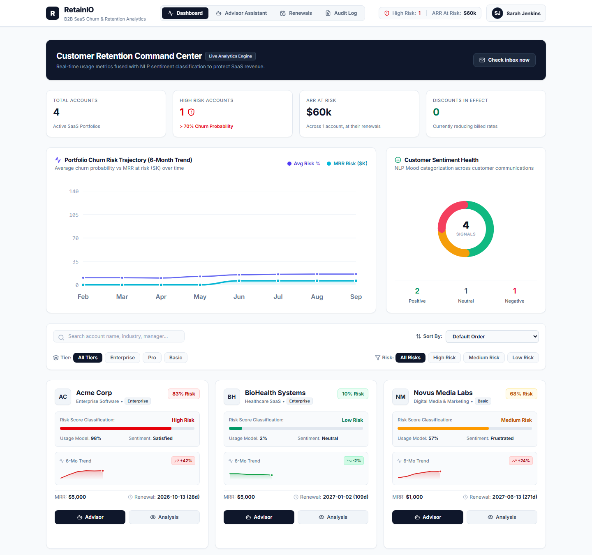
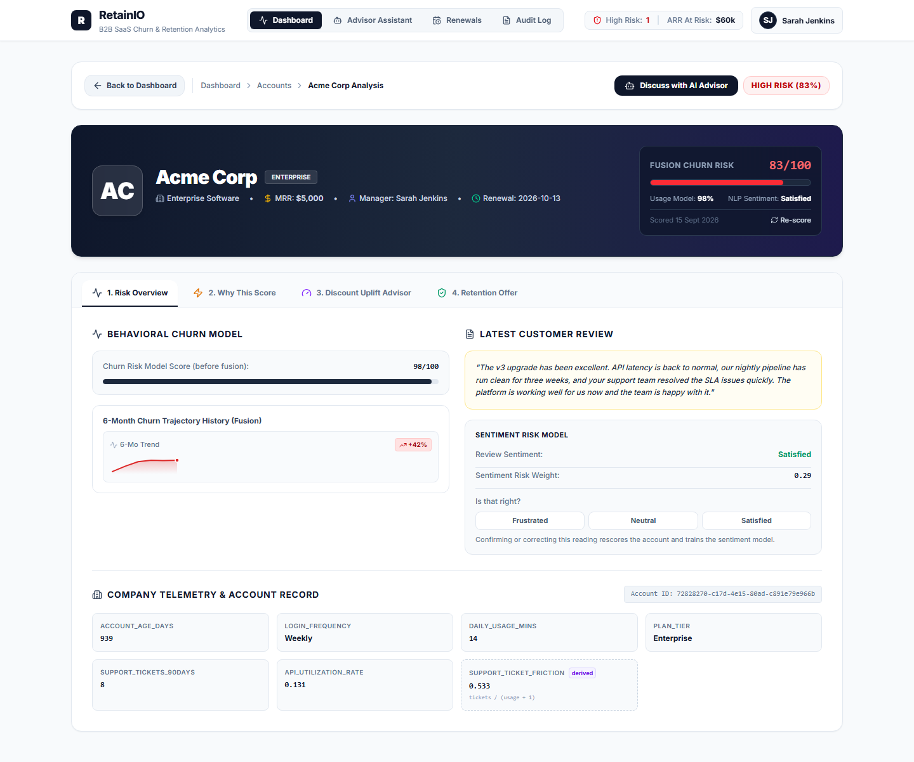
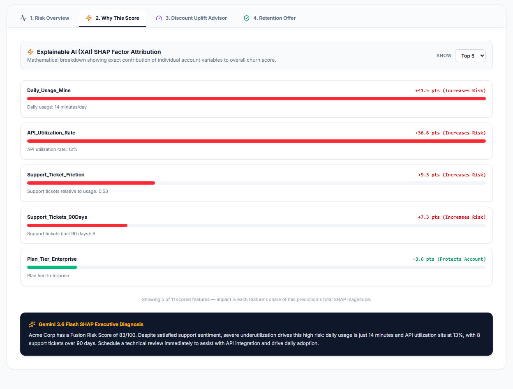
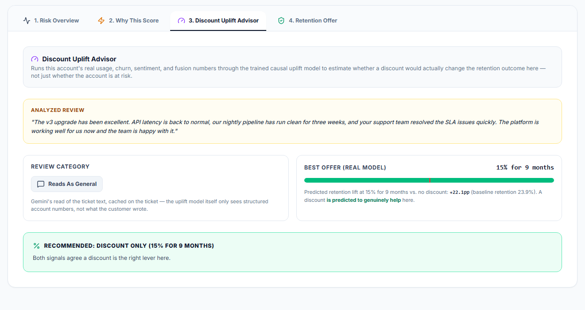
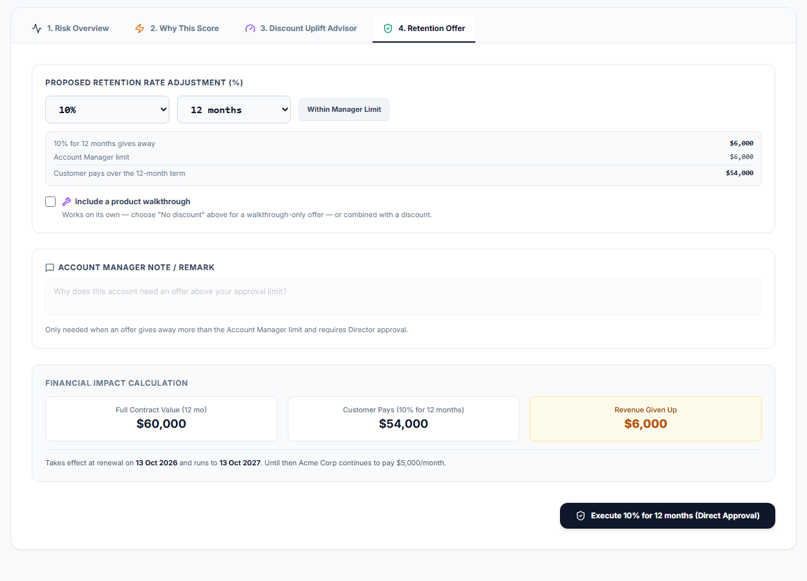
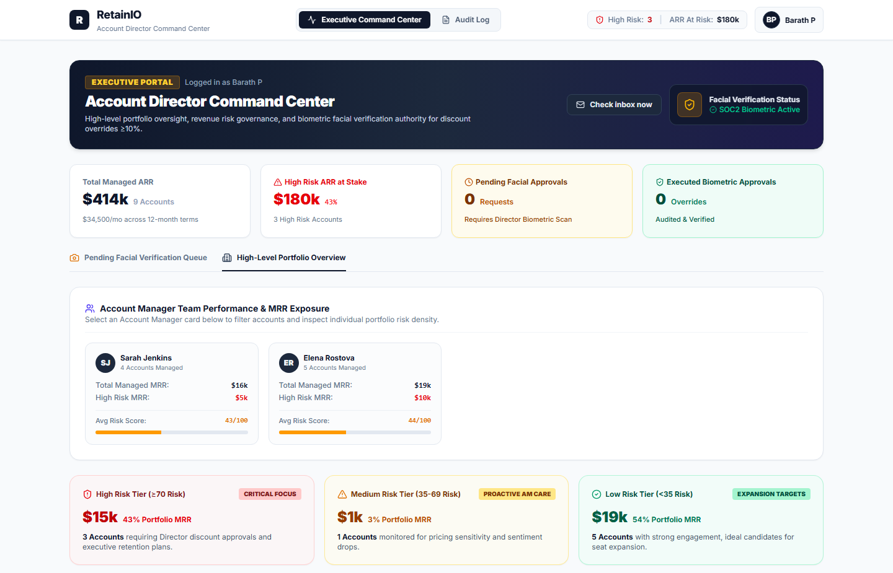
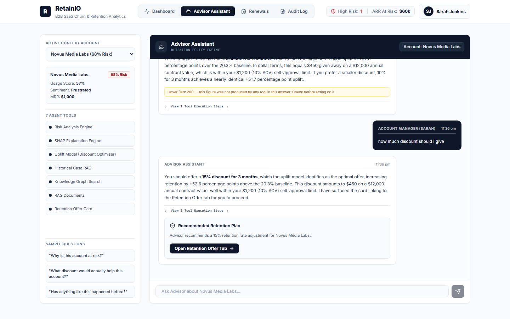
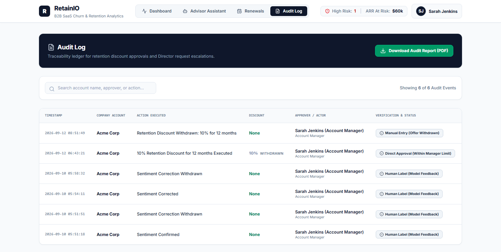
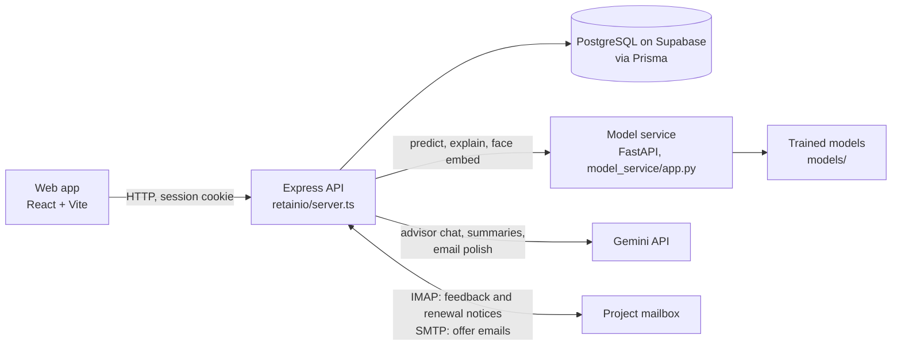

<div align="center">

# RetainIO

**Churn prediction and retention for B2B SaaS account teams**

See which customers are likely to leave at renewal, why, and whether a discount would actually change their mind.

Year 3 Major Project (CMP3101) · Diploma in Applied Artificial Intelligence · Temasek Polytechnic<br>
by Paramanandam Barath

</div>

<br>



## Why RetainIO

When a B2B SaaS customer leaves at renewal, a year of revenue goes with it. Account Managers often find
out only when the notice arrives, and the usual rescue, a discount, is handed out on instinct: given to
customers who would have stayed anyway, and wasted on ones no discount would keep.

RetainIO answers three questions for every account, well before its renewal: how likely it is to leave,
why, and what an offer would change. Every offer then stays inside the company's approval rules.

## The loop

1. **Score.** Every active account is re-scored daily from its product usage and the customer's own words.
2. **Explain.** The factors behind each score are shown in plain sentences, with an AI-written summary.
3. **Advise.** A causal uplift model estimates how each possible offer would change the chance of renewal.
4. **Act.** The Account Manager makes an offer. Anything above their limit needs a Director's live face check.
5. **Learn.** Every renewal's outcome is recorded as a training row, so the models can be retrained on what
   actually happened.

## A tour

### Risk Overview

Each account gets one risk score from two models. A churn model reads its usage and account record
(account age, login frequency, daily usage, API use, support tickets and plan), and a sentiment model
reads the customer's latest review or email. A stacking model combines the two. If the sentiment reading
looks wrong, the Account Manager can correct it: the account is re-scored and the correction is kept as
training data.



### Why This Score

The SHAP factors behind the churn prediction, each shown as a plain reading of the account with how many
points it adds to or takes off the risk, followed by a Gemini summary of what is driving it and what to do.



### Discount Uplift Advisor

"Is this account at risk?" and "would a discount help?" are different questions. The uplift model
estimates, for each of 21 offers (5, 10, 15, 20 or 25% for 3, 6, 9 or 12 months, or no discount), how much
the chance of renewal would change, and recommends the offer with the biggest predicted lift.



### Retention Offer

Offers follow the company's rules, and the server enforces them, not the page:

- offers open in the final 180 days before a renewal, or earlier if the customer says they are leaving;
- an Account Manager can approve an offer worth up to 10% of the account's annual contract value, and
  anything bigger goes to an Account Director, who has to pass a live face check;
- offers cannot stack, and one that has not started yet can be withdrawn;
- the offer email goes to the customer from the platform.

Before anything is sent, the page shows what the offer gives away over the term against the Manager's limit.



### Account Director

The Director sees the whole team: revenue at risk, each Account Manager's exposure, the risk tiers, every
account, and the queue of offers waiting for their face-verified approval.



### AI Advisor

A Gemini agent, built with LangGraph, that has seven tools. It can look up an account's scores and SHAP
factors, run the uplift model, search past retention cases and a knowledge graph, read the retention
policy and playbooks, and hand back an offer card that opens the Retention Offer tab. Any figure in an
answer that none of its tools produced is flagged as unverified, like the yellow note in the screenshot.
Conversations are saved per account.



### Renewals and the Audit Log

Customers' notices that they will leave, upgrade or downgrade are recorded by hand or read from emails.
At the end of each term the outcome is captured automatically, and an account that churns moves out of the
working lists into its own "Churned accounts" section, keeping its final score. Every approval, rejection,
withdrawal, renewal and offer email is in the Audit Log, which exports to PDF.



## Under the hood



- The browser never computes a score. It calls the Express API, which calls the model service for every
  prediction and stores the results in PostgreSQL.
- The API enforces every rule (approval limits, the offer window, no stacking), so nothing depends on the
  browser behaving.
- Each account is measured on the day its offer window opens, before any offer can reach it. Its renewal
  outcome can then train the uplift model without the offer having shaped the features.
- Background jobs run inside the server:
  - the daily update at 00:15 UTC (08:15 in Singapore), also run on start-up with a six-hourly safety net,
    which re-scores every active account, measures accounts entering the offer window and resolves
    renewals that have come due;
  - an inbox check every two minutes, when a mailbox is configured.

## The models

| Model | What it is | Result on held-out data | Notebook |
|---|---|---|---|
| Churn | Gradient boosting, with the decision threshold tuned to 0.56 for the churned class | 87.2% accuracy, F1 0.82 on churned customers (376 test customers) | [notebooks/churn_model.ipynb](notebooks/churn_model.ipynb) |
| Sentiment | TF-IDF with Naive Bayes: Frustrated, Neutral or Satisfied | 74.1% accuracy, weighted F1 0.74 (135 validation reviews) | [notebooks/sentiment_model.ipynb](notebooks/sentiment_model.ipynb) |
| Fusion | Stacking: a logistic regression over the churn probability and the sentiment reading, threshold 0.54 | 87.8% accuracy, F1 0.83 on the same 376 customers; not a significant gain over churn alone (McNemar p = 0.69) | [notebooks/late_fusion.ipynb](notebooks/late_fusion.ipynb) |
| Discount uplift | X-learner over the 21 offers and 11 features, trained on 238,000 rows | Following its offers gives an estimated 75.8% retention, against 61.0% for the offers in the data and 54.1% with no discount | [notebooks/uplift_model.ipynb](notebooks/uplift_model.ipynb) |
| Face match | FaceNet embeddings (keras-facenet, pretrained) | — | — |

- **Sentiment.** The sentiment notebook's own winner, by cross-validation, is Linear SVM. The fusion
  notebook picks the sentiment model by validation weighted F1, where Naive Bayes is just ahead (0.740
  against 0.738), and that is the model the app uses.
- **Uplift.** The X-learner beat T-learners and deeper trees on validation Qini (0.090, the best of six
  candidates). The retention figures are doubly-robust off-policy estimates on the test set. The notebook
  saves whichever learner wins to `models/uplift_pooled_t_duration.pkl`.
- **Fusion.** `fusion_mcnemar_test.py` runs the significance test against the churn model alone.

## Built with

| Part | Technology |
|---|---|
| Web app | React 19, TypeScript, Vite, Tailwind CSS |
| API | Node.js, Express, Prisma, PostgreSQL on Supabase |
| Model service | Python, FastAPI, scikit-learn, SHAP |
| Face check | FaceNet embeddings (keras-facenet on TensorFlow) |
| AI | Google Gemini, with LangGraph for the advisor agent |
| Email | IMAP for incoming feedback and notices, SMTP for offer emails |

## Repository layout

```
notebooks/               the four model notebooks
  churn_model.ipynb      churn model: baselines, class weighting, threshold tuning, SHAP
  sentiment_model.ipynb  sentiment model
  late_fusion.ipynb      combining churn and sentiment (average, weighted, stacking)
  uplift_model.ipynb     discount uplift model: T- and X-learners, Qini, policy value
fusion_mcnemar_test.py   significance test: fusion against the churn model alone
Datasets/                training data and splits, the uplift data generator, the retraining script
models/                  the trained models
model_service/           the FastAPI service that serves every model
retainio/                the web app: React front end, Express API, database schema and scripts
screenshots/             the images in this README
school/                  course documents: weekly progress reports, meeting minutes and the rubrics
```

## Limitations

- **The data is not from real customers.** The churn dataset is partly synthetic (agreed with the
  supervisor). The discount-response data is generated by `Datasets/generate_uplift_observational.py`.
  Day-to-day usage readings are generated by a simulator, not measured, although each one is scored through
  the real models. The uplift results show the model recovers the effects in that simulation, not that
  discounts work on real customers.
- **Fusion is not significantly more accurate than churn alone.** On the 376-customer test set, fusion's F1
  for churned customers is 0.83 against 0.82 for the churn model alone, and the McNemar test gives
  p = 0.69. Its value is that the customer's own words change the risk score between usage updates, and
  that a manager can correct the sentiment reading.
- **Nine accounts produce about nine renewals a year**, against a training set of hundreds of thousands of
  rows, so retraining on real outcomes will not measurably change the models for a long time.
